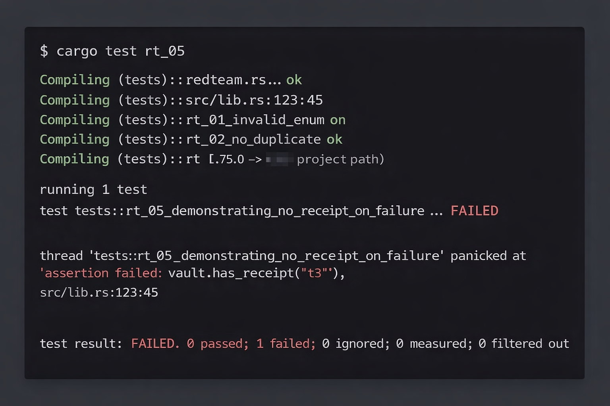

  

<h1 align="center">Vault Authority v1.1</h1>

<strong>Autonomous, Fail-Closed Remediation</strong>

Cold, mechanical legitimacy.

⸻

Stop fixing the same failures twice.

Vault Authority detects known infrastructure failures, fixes them automatically, and emits cryptographic proof that the fix actually happened.
   •   No tickets
   •   No 3:00 AM pages
   •   No manual compliance logging
   •   No partial mutations or “best effort”

If an action fails: no receipt, no mutation.
If a receipt exists: the action succeeded.

⸻

Why Teams Use This

Problem	Traditional Automation	Vault Authority
Token expiration	Manual refresh every time	Auto-remediated with signed receipt
Rate limits / traffic spikes	On-call scramble + config edits	One-step adjustment + audit log
DB locks / zombie processes	DBA intervention	Automated cleanup, zero page alerts
Compliance proof	Slack screenshots & spreadsheets	Ed25519 receipts & immutable logs

Vault Authority is not fast — it is correct.
Speed is a side effect of not breaking.

⸻

Core Guarantee: Execution Cannot Lie

validate → check → execute → commit → sign → persist
(failure aborts instantly: zero state change)

Invariants
   •   INV-1 Enum Gating — Only approved failure types execute
   •   INV-2 Atomicity — No partial mutation, ever
   •   INV-3 Boundary Control — Controlled executor surface
   •   INV-4 Idempotency — Duplicate incidents rejected before execution

⸻

Red-Team Verification (RT-05)

These screenshots are pulled directly from the adversarial test suite.

Failure Before Fix — Incorrect Behavior (Bug State)
Execution failed, yet a receipt existed. Atomicity was violated and flagged.

  

Pass After Fix — Correct Fail-Closed Behavior
Execution failure produces no receipt and no mutation. Invariant restored.

  

Run locally:

cargo test rt_05

⸻

Quickstart

git clone https://github.com/your-org/vault-authority
cd vault-authority
cargo test redteam
cargo build --release

Integrate from your monitoring / alerting pipeline:

use vault_authority::{Vault, ShellExecutor};

let vault = Vault::new();
let executor = ShellExecutor;

vault.remediate(
    "incident-1234",
    "ERR_AUTH_EXPIRED",
    &executor
)?;

⸻

What This Is / What This Isn’t

This is
   •   A deterministic remediation gate
   •   Cryptographically auditable execution
   •   Fail-closed by construction
   •   Red-team verified

This is not
   •   A workflow engine
   •   A YAML sprawl
   •   “Best effort” automation
   •   An LLM agent

⸻

License

MIT — use, modify, and deploy freely.

⸻

Vault Authority exists to make repeatable failures boring, provable, and safe.
